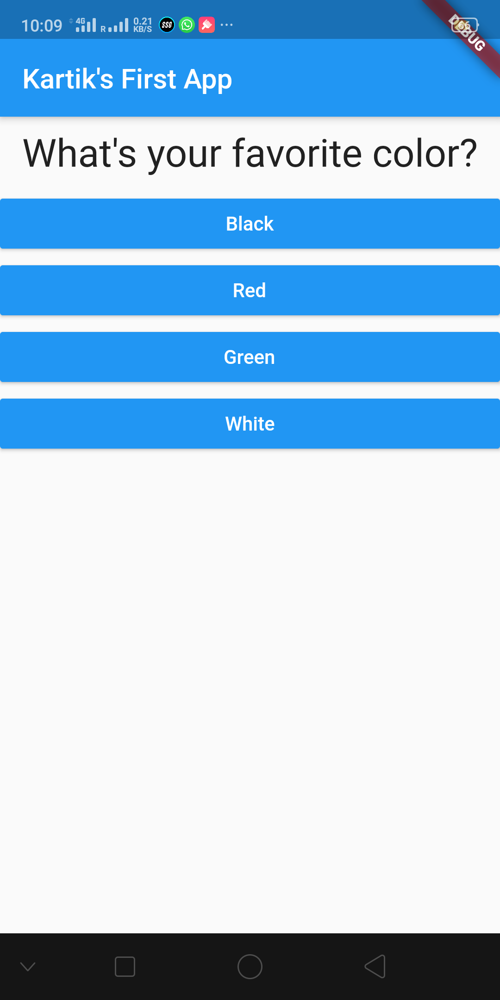
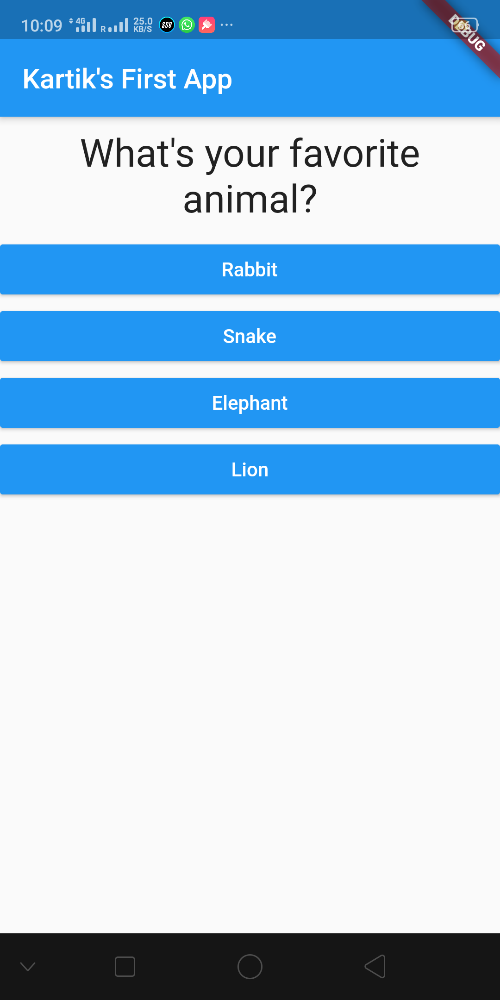
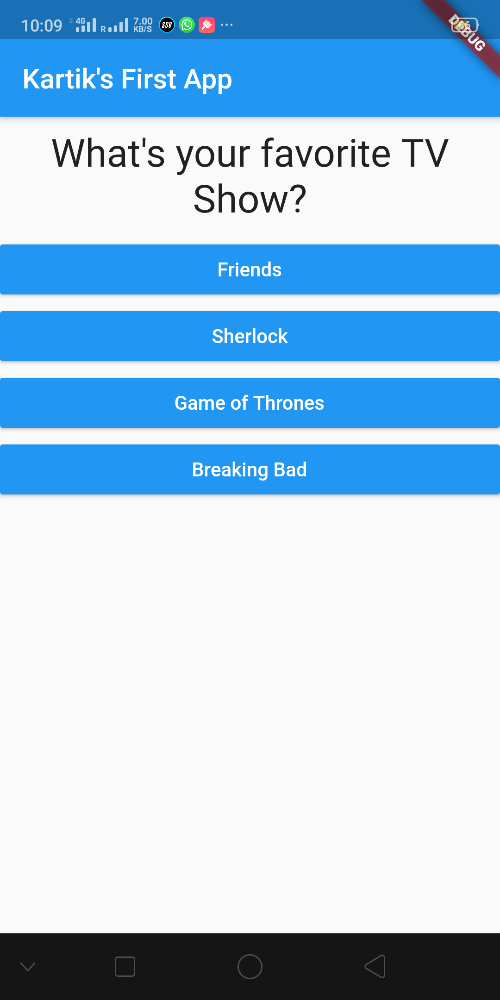
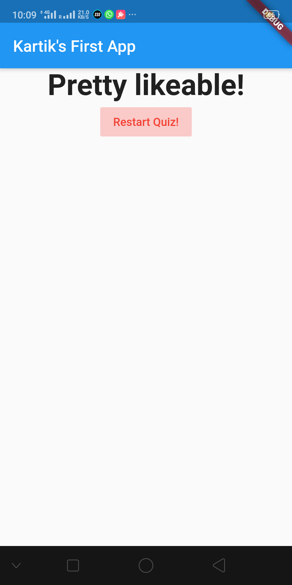

# flutter_project1

This is a personality test quiz app (a basic one) built in flutter.

Screen 1: First question 

Screen 2: Second question

Screen 3: Third question

Screen 4: Personality quiz result, based on the answers chosen, and also with a restart button to restart the quiz:

